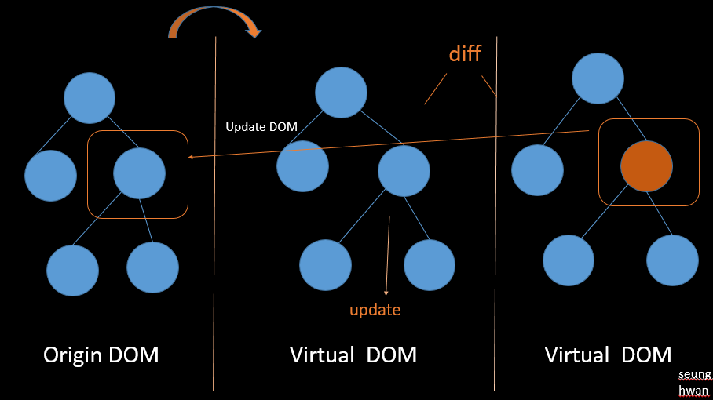
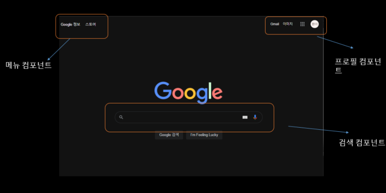
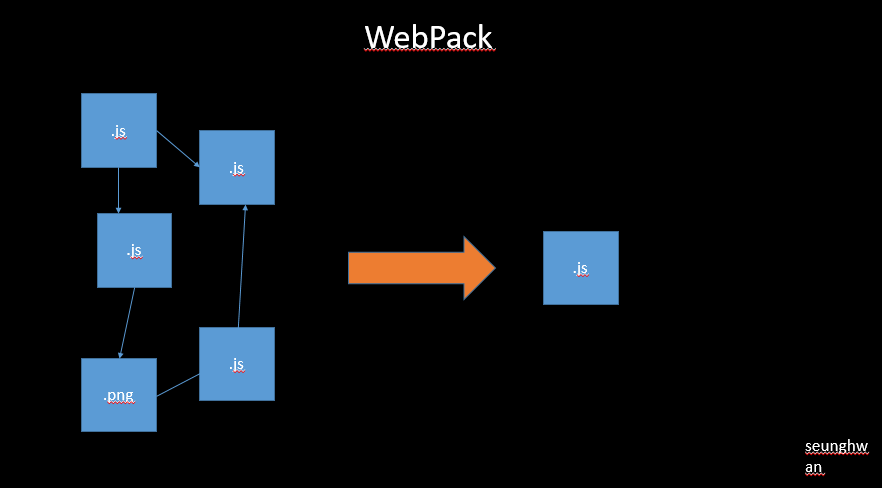
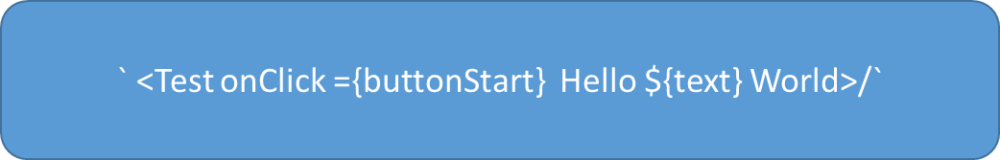

# Part1 리액트 동작원리 및 개념

<br>

# 탄생 배경


이벤트 핸들러가 많아지게 된다면 그림과 같은 구조가 되고 복잡해지게 됩니다.
이러한 요소가 많을 수록 페이지의 실행 속도는 느려지게 되고 성능상에 좋지않는 영향을 끼치게 됩니다.

그래서 *Angular* , *vue* , 등 많은 프레임워크가 만들어졌는데 이 프레임워크들은 작동방식이 다르지만 공통된 특징이 있는데 , 특정 값이 바뀌면
DOM 속성이 바뀌도록 연결을 해줘서 업데이트 하는 작업을 간소화 해주는 방식으로 웹개발의 어려움을 해결해주었습니다.


# Virtual DOM



리액트는 DOM을 직접 건드리는 작업은 번거롭다 판단을 해서 규칙을 정하는 것이 아니라,
DOM을 전부 날리고 다시 새로 만들어서 보여주자는 발상으로 만들어지게 되었다.

하지만 이렇게 하다보면 매번 DOM을 새로 만들기 때문에 이슈가 발생하는데 이때 문제를 가상 DOM을 사용해서 업데이트가 필요한 부분만 가상 DOM으로 수정하고
가상 DOM이 원본 DOM의 복사본으로 업데이트 되는 방식입니다.

<br>

# Virtual DOM FLOW

1. React는 원본 DOM의 복사본인 가상 DOM을 생성합니다.
DOM의 각 노드는 요소를 나타냅니다.

<br>


2. 다음으로 요소 상태 업데이트가 있으면 복사본 DOM에서 새로운 가상 DOM이 생성됩니다.

<br>

3. `diffing 알고리즘`을 통해서 변화를 식별

<br>

4. 마지막으로 변화된 요소들을 찾으면 `Origin DOM`을 업데이트 합니다.

<br>

# 컴포넌트
- 리액트로 만들어진 앱을 이루는 최소한 단위

    => 리액트는 `여러 컴포넌트 조각`으로 되어 있음

<br>

- 레고 블럭이라고 생각하면 쉽습니다.


<br>

- 재사용성 용이


- 메뉴 컴포넌트 , 프로필 컴포넌트 , 검색 컴포넌트가 하나로 모여서 
하나의 `Web`이 완성이 됩니다.



<br>


# Class vs Functional 

## 차이점

|              Class              |           Functional            |
|:-------------------------------:|:-------------------------------:|
| React 요소를 반환하는 render()가 필요 `O` | React 요소를 반환하는 render() 필요 `X`  |
|      React 생명주기 메서드 사용 `O`      |     React 생명 주기 메서드 사용 `X`      |
|    Class 구성 요소 내에서 다른 구문이 필요    | 다른 구문이 필요하지않고 <br/>쉽게 상태 저장을 만듬 |


## Class Component


```js
class Counter extends  Component {


    constructor(props) {
        super(props);


        // 상태 state는 무조건 객체
        this.state = {
            num: 0,
        };
        // bind 처리 코드
        // this.plus = this.plus.bind(this);
    }
    
    
    render(){
        return(
            <div className="App">
                Hello
            </div>
        )
    }
}


```
---------------------------------------------

## Functional Component

```js

const Counter =()=>{

    const [num,setNum]= useState(0);
    
    return(
        <div className="App">
            Hello
        </div> 
    )

}

```

<br>

# Render()

### Render (element , container , callback)

- `Element` : 랜더링 될 JSX 표현식
- `container` : 요소가 랜더링되는 컨테이너
- `callback` : 추가적인 콜백함수 


=> 전달한 컨테이너 노드를 제어합니다.
처음 호출 할때 기존의 DOM 요소를 교체하고 이후 호출은 React의 DOM diff 알고리즘을 사용해서 업데이트합니다.


# createRoot

- Render()와 같은 역할을 하고 있는 메서드


<br>

# Hydrate()

### hydrate ( element , container , callback)
- Render () 와 동일
- 서버 측 랜더링을 위해서 구현 


<br>

# findDOMNode()
### findDOMNode (component)
- 매개 변수로 전달받은 컴포넌트가 DOM 내부에 마운트되었다면 컴포넌트에 해당하는 브라우저의 DOM 요소를 반환합니다.

<br>

- 주로 DOM 값을 읽을 때 유용 => 대부분의 경우 ref를 사용하기 때문에 findMode는 사용할 필요가 없습니다.

<br>

# creratePortal()
### createPortal ( child , container )

- `Child` : 이 매개변수는 JSX 표현식 또는 React 구성 요소가 랜더링 될 것으로 예상 됩니다.

- `Container` : 이 매개변수는 요소가 랜더링 되어야 하는 컨테이너를 예상합니다.

<br>

# unmountComponentAtNode()

### unmountComponentAtNode ( container )
- `Parameters` : 이 메서드는 React 구성요소를 제거해야 하는 DOM 컨테이너를 예상하는 매개변수 컨테이너를 사용합니다.

<br>

# React Life Cycle
생명주기 메서드는 컴포넌트가 Browser 상에 나타날때 업데이트 되고 사라지게 될 때 호출되는 메서드들 입니다.

생명주기 메서드는 Class 형에서만 쓸 수 있는데 클래스를 사용하지 않는다면 굳이 필요하지 않는 메서드들이라서 동작원리만 알아두면 됩니다.


<br>

## Mount

* **Constrcutor** <br>
컴포넌트가 만들어지면 가장 먼저 실행되는 메서드 입니다.


* **getDerivedStateFromProps** <br>
getDerivedStateFromProps는 props로 받아온 것을 state에 넣어주고 싶을 때 사용합니다.


* **Render** <br>
  랜더링하는 메서드


* **componentDidMount** <br>
컴포넌트의 첫 렌더링이 끝나고 나면 호출되는 메서드이고 우리가 만든 컴포넌트가 화면에 나타난 상태가 됩니다.


<br>

## updateMount 
getDriveStateFromProps를 통해서 컴포넌트의 props나 state가 바뀌었을때도 이 메서드가 호출이 됩니다.


* **shouldComponentUpdate** <br>
이 메서드는 리랜더링하는 메서드입니다.
주로 최적화 할때 사용합니다.


* **Render** <br>
랜더링하는 메서드


* **GetSnapshotBeforeUpdate** <br>
컴포넌트에 변화가 일어나기 전에 DOM 상태를 가져와서 특정 값을 반환하면 그 다음 발생하게 되는 componentDidUpdate 함수에서 받아와서
사용을 할 수 있다.


* **componentDidUpdate** <br>
화면에 우리가 원하는 변화가 모두 반영되고 난 뒤 호출되는 메서드


## componenetWillUnMount
컴포넌트를 제거하고 DOM 이벤트를 전부 제거합니다.


<br>

# WebPack




### 웹펙이란?

여러개 파일을 하나로 묶어주는 역할
즉 여러개로 나눠진 .js 파일을 html이 실행할 수 있는 하나의 .js파일로 합치는 라이브러리

## why?
많은 파일을 다운 받으면 Network 부하가 커지고 같은 이름의 변수나 함수로 충돌 가능성이 있음


<br>


# WebPack

## 1. npm init <br>

``npm init``

리액트에 필요한 모든 패키지들을 넣는 package.json 파일 생성


<br>

## 2. npm i react react-dom
``npm i react react-dom``

리액트를 사용하기 위해서는 react 패키지랑 , react-dom 패키지가 필요하니 바로 설치 진행

<br>

## 3. npm i -D webpack webpack-cli
``npm i -D webpack webpack-cli``

바로 웹팩을 설치해주는데 (-D) 는 실제 서비스할때 웹팩이 필요가 없고 개발할때만 필요하기 때문에 개발용으로 설치하겠다는 의미


<br>

## 4. webpack.config 생성

웹펙을 설정 해줄 webpack.config 파일을 생성합니다.

<br>

## 5. npm i -D webpack-dev-server
``npm i -D webpack-dev-server``

웹펙 데브 서버는 웹 에플리케이션을 개발하는 과정에서 유용하게 쓰이는 도구입니다.
빌드 대상 파일이 변경되었을 때 매번 웹팩 명령어를 실행하지 않아도 코드만 변경하고 저장하면 웹펙으로 빌드한 브라우저를 새로고침 해줍니다.


<br>

## 6. npm i html-webpack plugin
``npm i html-webpack plugin``

웹팩은 HTML 파일 생성을 제공합니다. dev-server을 설치할때 같이 설치를 해줘야지 에러가 안나옵니다. 

## why?
같은 파일에 예를 들어서 컴포넌트가 2만개가 있다고 하면 유지보수가 힘들기 때문에 index.js 파일에서 호출하는 형식으로 사용을 하고
npm으로 가져와 줍니다.
즉 require webPackTest 파일만 가져와서 사용하겠다는 의미.


<br>

## util.js
```js
export const add =(num1,num2)=>{
    return num1+ num2;
}


export const hello =(name)=>{
    return name;
}
```


## webpack.config.js

```js
const path = require('path');

const HtmlWebpackPlugin = require('html-webpack-plugin');


module.exports={

    // 시작 파일  ( 사용하는 모듈들을 전부 파악 )
    entry: './src/index.js',

    // 만들어진 최종 파일을 만들어내는 내보내는 옵션
    output: {


        filename: 'main.js',

        // 폴더 경로 => 노드에서 사용하는 path 모듈 사용
        // 즉 현재 경로 하위에 dist를 의미
        path: path.resolve(__dirname,'dist'),
    },

    plugins: [
        new HtmlWebpackPlugin({
            template: "./index.html",
        }),
    ],

    // 개발서버 세팅
    devServer: {
        static:{
            directory: path.resolve(__dirname,'dist'),
        },


        port:8080,
    }
}

```


<br>


## 6. app.js 생성
webPack이 설치가 되고 app.js가 생성이 되는걸 볼 수 있습니다.


<br>


# Babel 
### 바벨이란? 

흔히 트랜스파일로 변환시켜주는 라이브러리 입니다.
브라우저는 JSX 문법 ,리액트에 쓰는 함수 등을 모르기 때문에 브라우저가 읽을 수 있는 JS로 바꿔주는 바벨을 설치 합니다.


<p align="center"></p>


<p align="center">

<p align="center"></p>


<br>

# Babel 설치

## 1. npm i -D @babel/core

``npm i -D @babel/core``

## 2. npm i @babel/preset-env
``npm i @babel/preset-env``

## 3. npm i babel-loader
``npm i babel-loader``

## 4. npm i -D @babel/plugin-proposal-class-properties
``npm i -D @babel/plugin-proposal-class-properties``


