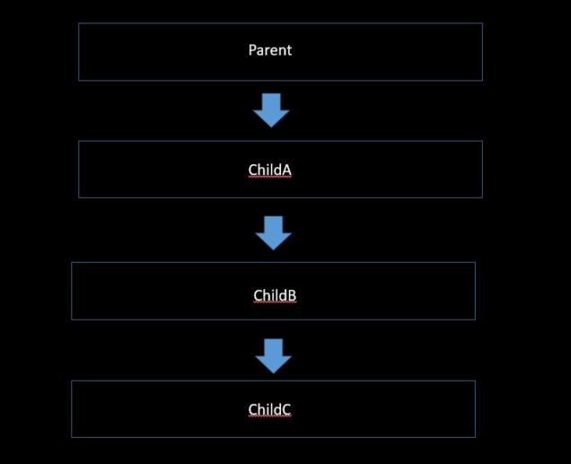
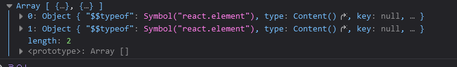

# JSX
jsx는 리액트에서 사용하는 문법 입니다.
얼핏보면 html과 흡사하지만 실제로는 Javascript 문법과 비슷합니다.

jsx가 Javascript로 제대로 변환이 되려면 지켜주어야 하는 규칙이 있습니다.


<br>
<br>


## 1. 두 가지 이상의 태그는 무조건 하나의 태그로 감싸져야한다.

```js

// 정상 코드
functional App(){

    return (
        <main>
            <Hello>
            <div></div>
            <p>></p>
        </main>
    )
}


```


<br>


```js

functional App(){

// 잘못된 코드
    return(

        <div></div>
        <div></div>
    )
}

```


<br>
<br>


## 2. JSX 내부에서 자바스크립트 변수를 보여줘야 할 때는 {} 사용 한다.

```js

function App(){

    const name ="react";
    const style ={color : 'red'};

    return(

        <div style={style}>
            {name}
        </div>
    )
}

```


<br>
<br>

# Props
React가 컴포넌트로 작성한 Element를 발견하면 해당 컴포넌트에 단일 객체로 JSX를 전달합니다.

props는 "properties" 의 줄임말이고 쉽게 말해서 부모 컴포넌트에 자식 컴포넌트로 전달해주는 객체입니다.


그리고 props는 읽기전용이라서 직접적으로 props를 수정해서는 안됩니다.


<br>
<br>


# Props Flow

```js

import './App.css';

import Welocome from './ch2-1/Welcome';


// 1
function App() {
  return (
    <div className="App">
  
    <Welocome name={"react"}/>

    </div>
  );
}


const root = ReactDOM.createRoot(document.getElementById('root'));

// 4
root.render(
  <React.StrictMode>
    <App />
  </React.StrictMode>
);


export default App;


```


<br>


```js
import React from 'react';


const Welocome =(props)=>{

    // 3
    return(
        <div>
            <h1>Hello {props.name}</h1>
        </div>
    );
}

export default Welocome; 


// 출력 결과
hello react
```


위의 예시는 다음과 같은 일들이 일어납니다.

1. App.js 에서 `<Welcome name ={"hwan"} />` 엘리먼트로 ReactDom.render()를 호출합니다.

2. React는 {name : 'react'}를 props로 하여 Welcome 컴포넌트를 호출합니다.

3. `Welcome 컴포넌트는` 결과적으로 `<h1>Hello react</h1>` 엘리먼트를 반환합니다.

4. ReactDOM은 `<h1>Hello react</h1>` 엘리먼트와 일치하도록 DOM을 효율적으로 업데이트 합니다.


<br>
<br>


# Props Drilling (프로퍼티 내리꽂기)




props를 오로지 하위 컴포넌트로 전달하는 용도로만 쓰이는 컴포넌트들을 거치면서 React Component 트리의 한 부분에서 다른 부분으로 데이터를 전달하는 과정입니다.

prop drilling이 보통 3~5개 컴포넌트를 거치는 정도이면 , 괜찮을 수 있으나 , 10개 이상을 거친다면 중간 컴포넌트들은 불필요하게 props를 받게 되어 가독성이 떨어져 유지보수가 어려워집니다.


이를 해결하기 위해서 전역 상태 관리 라이브러리인 `Context api`와 컴포넌트 합성이라 부르는 `Composition`을 사용할 수 있습니다.

다음 먼저  간단한  프로퍼티 드릴링 예제를 살펴보도록 합시다.


<br>
<br>

```js

export default function Parent(){
  const [fName , setfName] = useState('fName');
  const [lName , setlName] = userState('lName');


  return(
    <div>
        <div>
              This is a Parent component
        </div>

        <br/>
        <ChildA fname={fName} lname={lName}/>
    <div/>
  );
} 


```


<br>


```js

function ChildA({fname,lname}){


  return (
    <div>

      <div>
          This is ChildB Component.
      </div>

      <br/>

      <ChildB fname ={fName} lname ={lName}/>

    <div/>
  );
}

```


<br>


```js

function ChildB({fname,lname}){
    return(

      <div>

          <div>
              This is ChildB Component.
          </div>

          <br/>

          <ChildC fname={fname} lname={lName}>
      </div>
    )
}

```

<br>

```js

function ChildC({fname, lname}){
  return(

      <div>

          <div>
               This is ChildC Component.
          </div>

          <br/>

          {fname}
          {lname}

      </div>

  )

}

```


<br>


굉장히 비효율적으로 동일한 데이터가 내려가는 것을 확인 할 수 있습니다.
이렇게 컴포넌트가 대략 100개라고 가정하면 웹 속도가 굉장히 느려지게 되고 props의 이름이 전달중에 변경되어서 데이터를 추적하기가 어려워 집니다.


<br>
<br>

# Context API
context는 전역적 `(global)`이라고 볼 수 있는 데이터를 공유할 수 있도록 고안된 방법입니다.
context 사용함으로 모든 컴포넌트를 일일이 통하지 않고도 원하는 값을 `컴포넌트 트리 깊은 곳` 까지 보낼 수 있습니다. 

<br>
<br>

## React.createContext

```js
let context = React.createContext(null);
```
Context 객체를 만듭니다.

<br>
<br>


## Context.Provider

```js
<MyContext.Provider value={`test`}>  
```

Context에 포함된 React 컴포넌트인 Provider는  컴포넌트들에게 context 변화를 알리는 역할을 합니다.

`Provider 컴포넌트`는 `value prop`을 받아서 이 값을 하위에 있는 컴포넌트에게 전달합니다. 값을 전달받을 수 있는 컴포넌트의 수에 제한은 없습니다.


<br>
<br>


```js

import React, { useContext } from "react";
import {useState} from "react";
let context = React.createContext(null);


export default function Parent2(){

        const [fName, setfName] = useState('fristName');
        const [lName, setlName] = useState('lastName');

        return(

            <context.Provider value={{fName, lName}}>

                    <div>
                        This is a Parent component
                        <br/>
                        <ChildA/>
                    </div>

            </context.Provider>
        );
}


function ChildA() {

    return (
        <>
            <h3>This is ChildA Component.</h3>
            <br />
            <ChildB />
        </>
    );
}


function ChildB() {

    return (
        <>
            <h3>This is ChildB Component.</h3>
            <br />
            <ChildC />
        </>
    );
}


function ChildC() {


    const {fName,lName} = useContext(context);
 
    return (
        <>
            <h3>This is ChildC component.</h3>
            <br />
            <h3> Data from Parent component is as follows:</h3>
            <h4>{fName}</h4>
            <h4>{lName}</h4>
        </>
    );
}


```


<br>
<br>


# Composition ( 합성 )
리액트는 훌륭한 컴포지션 모델을 가지고 있고 상속을 사용하기보다 컴포지션 형태로 사용하여 컴포넌트 재사용을 권하고 있습니다.

그리고 공식문서에서는 Context를 사용하기 전에 Composition을 통해서 해결할 수 있는 문제인지 고려해보고 Context를 사용하기전에 Compositon을 사용하라고 나와 있습니다.

왜냐하면 Context에도 단점이 존재하는데 props를 직접 넘겨주는 방법은 코드 상에서 해당 컴포넌트의 input이 무엇인지 확인 할 수 있지만 useContext로 컴포넌트 내부에 값에 접근하게 되면 해당 컴포넌트의 사용처에서 컴포넌트 내부에서 어떤 값이 쓰이고 있는지 보이지 않습니다.


이러한 이유로 Compostion을 적극 권하고 있습니다.





위 사진은 아래 코드를 빌드하고 props를 console.log 했을때 출력되는 사진입니다.

Content() 컴포넌트 2개가 출력되는걸 확인 할 수 있습니다.


<br>
<br>


## Compositon Example

```js

import React from "react"

export default function compostion(){

    return(
        <>
            <Sidebar >
                 <Content/>
                 <Content/>
            </Sidebar>
        </>
    );
}


const Sidebar=(props)=>{

    return(
        <div className="sidebar">

            {props.children}

        </div>

    );
}

const Content=()=>{

    return(
        <div>
                <h1>Sidebar data 1</h1>
                <h1>Sidebar data 2</h1>
                <h1>Sidebar data 3</h1>
                <h1>Sidebar data 4</h1>
        </div>
    );
}

```

<br>
<br>


이 컴포지션 방법으로 위에서 했던 Context API 예제를 바꿔봅니다.


```js

import { useState } from "react";


export default function Parent3(){


    const [fName, setfName]= useState('firstName');

    const [lName,setlName] = useState('lastName');

    return(

            <>
              <ParentComponent>
                        <ChildA>
                                <ChildB>
                                        <ChildC data1={fName} data2={lName}/>
                                </ChildB>
                        </ChildA>
              </ParentComponent>
            </>
    );
}

const ParentComponent=(props)=>{

        return  (
                <div>{props.children}</div>
        );

}


const ChildA =({children})=>{
        return(

                <>
                        <h3>This is ChildA Component.</h3>
                        <br/>
                        {children}
                </>
        )
}


const ChildB=({children})=>{

        return(

                <>
                        <h3>This is ChildB Component.</h3>
                        <br/>
                        {children}
                </>
        )
}


const ChildC=({data1,data2})=>{

        return(
                <>
                        <h3>This is ChildC Component.</h3>
                        <br/>
                        <h4>{data1}</h4>
                        <h4>{data2}</h4>
                </>
                
        );
}
```

<br>
<br>

컴포지션을 통해 요소를 둘러쌀 때 마다 `상위 구성 요소`가 됩니다.<br> 
그런 다음 `자식 구성 요소`들을 랜더링하는
역할을 하는 `ParentComponent`를 만들어서 부모 구성 요소내에서 자식 구성 요소들을 받아서 출력 할 수 있습니다.


<br>
<br>

# State
state는 객체에 대한 업데이트를 실행합니다.
즉 state가 변경되면 컴포넌트는 리랜더링 되는 것 입니다.


- 클래스형 컴포넌트가 가지고 있는 state
- 함수형 컴포넌트가 useState라는 함수로 사용하는 state

<br>
<br>

# State vs Props
props 와 state는 일반 js 객체입니다. 
두 객체 모두 랜더링 결과물에 영향을 주는 정보를 갖고 있는데 , 한 가지 중요한 방식에서 차이가 있습니다.
`props`는 컴포넌트에 전달되는 반면 `state`는 ( 변수처럼 ) `컴포넌트 안에서 관리`됩니다.

즉 props는 항상 부모에서 설정해주는 것이고 , state는 자신이 직접 변경하고 마음대 조작이 가능하다.

<br>
<br>

## Classs State
```js
import React, {Component} from 'react';

class Counter extends Component{

    constructor(props){
        super(props); // constructor 정의 시 반드시 필요!
        this.state = { // state의 초기값 설정 부분
            number:0
        };
    }

    this.setState=
}
```

state의 이름과 초기값을 constructor(생성자)에서 설정해주고 , render() 함수에서 this.setState 함수를 통해 state를 변경해 줄 수 있습니다.


<br>
<br>


## Funcional State
클래스형 컴포넌트에서는 `this.state ={}`  값을 정하고 , `this.setState` 함수로 state의 값을 변경하는 방식이였습니다.

하지만 함수형 컴포넌트에서는 `useState` 함수가 이 두개의 역할을 같이 할 수 있게 해줍니다.


```js

import React from "react";
import { useState } from "react";
const Say=()=>{


// 배열 비구조화 할당 
    const [message , setMessage] =useState('초기값');

    const onClickEnter=()=>{
        setMessage('안녕');
    }
    const onClickLeave=()=>{
        setMessage('잘가!');
    }

    return(
        <div>
            <button onClick={onClickEnter}>입장</button>
            <button onClick={onClickLeave}>퇴장</button>

            <h1>{message}</h1>
        </div>
    );
}

export default Say;
```


배열 비구조화 할당을 통해서 useState 함수를 호출할 시 배열이 반환되며 
배열의 첫번째 원소는 현재 상태 , 두번째 원소는 상태를 바꾸어 주는 함수가 됩니다.

즉 , message는 현재 state 상태가 저장되고 , setMessage는 state를 바꾸어 주는 setter함수가 됩니다.


<br>
<br>


# List Key
key는 React가 어떤 항목을 추가 , 삭제할지 식별할때 사용을 합니다.
고유성을 부여하기 때문에 배열 내부의 엘리먼트에 지정해야 합니다.


key를 선택하는 가장 좋은 방법은 리스트의 다른 항목들 사이에 해당 항목을 고유하게 식별할 수 있는 ID를 Key로 사용합니다.
```js
    
const todoItems = todos.map((todo) =>
  <li key={todo.id}>
    {todo.text}
  </li>
);

```

<br>
<br>
그럼 List Key가 어떻게 쓰이는지 배열 랜더링 예제를 보겠습니다.

아래와 같이 배열이 있다고 가정합니다.

```js
const users = [
  {
   id: 1,
    username: 'a',
    email: 'public.velopert@gmail.com'
  },
  {
    id: 2,
    username: 'b',
    email: 'tester@example.com'
  },
  {
    id: 3,
    username: 'c',
    email: 'liz@example.com'
  },

    
];
```


<br>
<br>


이 내용을 컴포넌트로 랜더링할려면 어떻게 할까요?
`map()` 을 사용해서 추출을 할 수 있습니다.

```js

export default function List_key(){

    return(

        <div>

            {user.map(($el)=>$el(
                <User user={$el} key={$el.id}/>
            ))}
        </div>
    )
}

function User(props){

    return(

        <div>
            <span>{props.user}</span>

            <span>{props.key}</span>
        </div>

    );
}
```

<br>
<br>

# key의 존재유무에 따른 업데이트 방식

예를 들어서 key가 없다고 하면 중간의 값이 바뀌었을때 그 하위 값들이 전부 변합니다.

즉 `key`가 있어야만 배열이 업데이트 될 때 효율적으로 랜더링되고 수정되지 않는 기존의 값은 그대로 두고 원하는 곳에 내용을 추가하고 삭제 할 수 있습니다.

리액트는 업데이트 요소들을 기존의 요소들과 비교 후에 변경하는데 이떄 Key로 식별한다.


<br>
<br>

# 조건부 랜더링
React에서 조건부 랜더링은 JS에서의 조건 처리와 같이 동작합니다.
즉 특정 조건에 따라 다른 결과물을 랜더링하는 것을 의미합니다.


주로 `삼항연산자 ( ? )` 와 `&&`를 사용해서 처리를 하고. 가독성이 좋다고 판단되는 것을 사용하면 됩니다.

```js
import React from "react";
const Render=({name,isSpecial})=>{
    return(
        <div>
        { isSpecial ? <b>조건부 랜더링</b> : null }
        안녕하세요 {name}
      </div>
    );
}


function App(){
    
    return(

        <div>
           <Render name ="react"  isSpecial={true}/>
        </div>
    )
}

export default Render;

// 결과
// 조건부 랜더링 안녕하세요 react 
```

현재 isSpecial은 true가 전달되고 있으므로 조건부 랜더링이 출력 됩니다.

<br>
<br>


# 리액트 컴포넌트 스타일링 ( Sass , CSS-Moudle , css-in-js ) 
리액트 컴포넌트를 스타일링 하는 방법은 다양한 기술이 사용되는데 그중에서 대표적인 
Sass , CSS-Moudle , css-in-js 에 대해서 알아보겠습니다.

가장 기본적인 방법은 css 파일을 만들어서 컴포넌트에서 import해서 사용하는 거지만 이보다 편리한 방법이 컴포넌트 스타일링 입니다.


<br>

# Sass

https://github.com/sass/node-sass

CSS-pre-processer 로서 , 복잡한 작업을 쉽게 할 수 있게 도와주고 , 코드의 재활용성을 높여줄 뿐만 아니라 , 코드의 가독성을 높여주어 유지보수가 간편해집니다.
그리고 `Dart` 기반으로 동작하며 Sass와 Sacc 문법을 제공합니다.


<br>
<br>

먼저 사용하기 앞서 `node-sass` 라이브러리를 설치 해줍니다.<br>
이 라이브러리는 Sass를 CSS로 변환해주는 역할을 합니다.

<br>
<br>


## 라이브러리 설치 

```js

npm install -g sass

```


## version 확인

```js

npm show sass version

```


<br>
<br>


# Css-Module
https://github.com/css-modules/css-modules

css 모듈을 이용하면 클래스명이 충돌하는 단점을 극복할 수 있습니다.
즉 고유의 값들을 가지고 있기 때문에  간결한 클래스명을 이용해서 컴포넌트 단위로 스타일을 적용할때 좋습니다.

<br>


## 사용법
```[파일이름].module.css```

```js
import styles from "./Box.module.css";

```

<br>

```js

import React from "react";
import styles from "./Box.module.css";


function  Box(){
    return (
        <div className={styles.Box}>{styles.Box}</div>
    );
}

export default Box;
```

<br>

```js
.Box{
    background: black;
    color: wheat;
    padding : 2rem;
}
```
fd

이처럼 현재 styles.Box를 출력 해보면 `파일 이름 , 클래스 이름 , 해쉬 값`이 포함되어서 출력이 됩니다. 

즉 고유값인 CSS 클래스들을 갖게 되어서 `파일 이름 , 클래스 이름 ,해쉬 값`이 생성이 됩니다.


