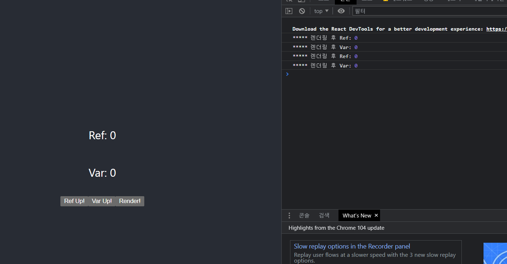
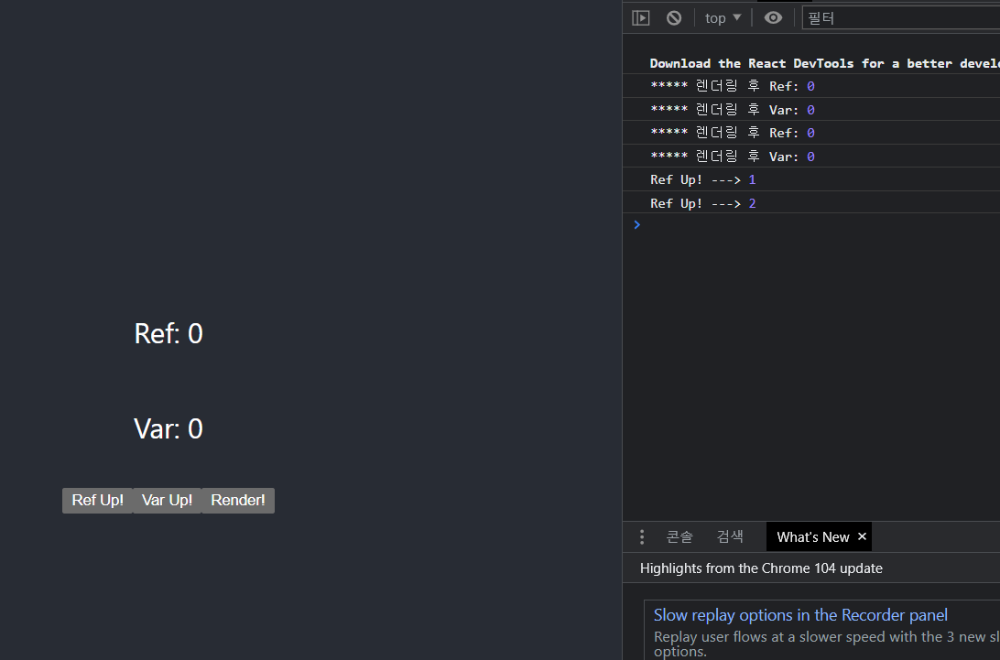
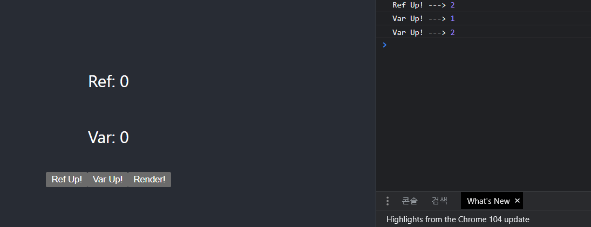
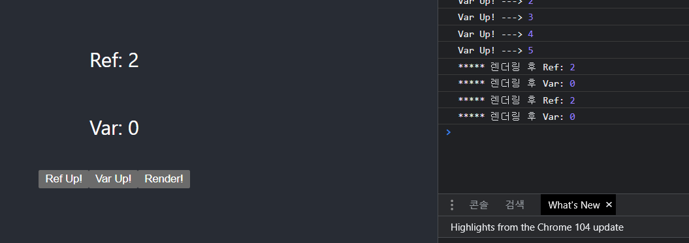
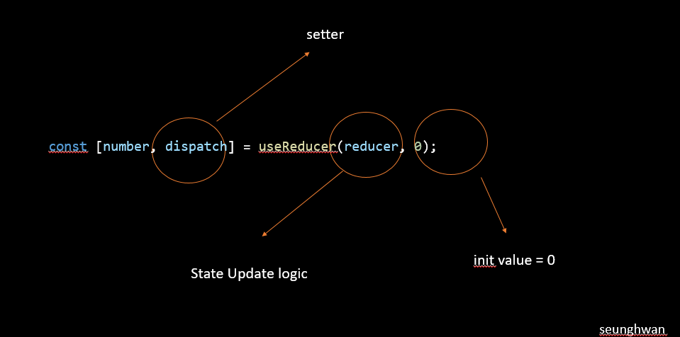

# React Hooks Life Cycle
React Hook은 함수형 컴포넌트에서 클래스형 컴포넌트의 기능을 구현한 개념입니다.

예를 들어 클래형 state를 훅(Hook)을 이용해서 함수형 Component에서도 
useState를 이용해서 상태 변수를 선언 할 수 있습니다.

또한 `useEffect()` 를 통해 리액트 클래스의 componentDidMount , componentDidUpdate , componentWillUnmount와 같은 라이프 사이클을 관리할 수 있습니다.

<br>
<br>


# 컴포넌트 랜더링
컴포넌트가 랜더링 된다는 것은 누군가가 그 함수를 호출하여 실행되는 것을 말합니다.

함수가 실행 될 때마다 내부에 선언되어 있던 표현식`( 변수 , 또 다른 함수)`도 매번 다시 선언되어 사용하고 컴포넌트는 자신의 `state`가 변경되거나 `props`로 전달받을때 리랜더링 됩니다.

또한  하위 컴포넌트에게 최적화 설정을 해주지 않으면 기본적으로 부모에게 받은 props가 변경되지 않더라도 리랜더링 되는게 `기본`입니다. => 이때  최적화를 위해 사용하는 것이 `useMemo` ,`useCallback` 입니다.


<br>

# componentDidMount 
빈 종속성 배열이 있는 useEffect가 이방법을 대체합니다.
배열에 값이 제공되지 않으면 마운트(랜더링) 시 훅만 평가합니다.


<br>
<br>


# componentDidUpdate
이 메서드는 종속성 배열이나 종속성 배열의 값이 없는 useEffect로 대체됩니다.

배열 자체가 제공되지 않으면 Hook는 다시 랜더링 할 때마다 평가됩니다.

배열에 값이 제공되면 해당 값이 변경될 때 훅이 평가됩니다.


<br>
<br>

# componentWillUnmount
return 문이 있는 UseEffect가 이 기술을 대체 했습니다.

useEffect()가 함수를 반환하면 해당 함수는 구성 요소가 DOM에서 제거된 후에만 호출됩니다.


<br>
<br>


# useEffect

```js
const value = useContext(MyContext);
```

useEffect 함수는 리액트 컴포넌트가 랜더링 될 때마다 특정 작업을 실행할 수 있도록 하는 Hook입니다.

컴포넌트가 마운트 됐을때(처음 나타날때) , 언마운트 됐을때 (사라질 때)
업데이트 됐을때(특정 props) 바뀔 때 특정 작업을 처리할때 주로 사용합니다.

<br>
<br>


## 기본 형태
```js
useEffect( function , deps)
```

- function : 수행하고자 하는 작업
- deps : 배열 형태이며 , 배열 안에는 검사하고자 하는 특정 값 or 빈 배열


<br>


## 1. Component가 mount 됐을 때 ( 처음 나타남 )

- 컴포넌트가 화면에 가장 처음 랜더링 될 때 한 번만 실행하고 싶을 때는 deps 위치에 빈 배열을 넣는다.


<br>

```js
useEffect(()=>{

    console.log('랜더링 될 때마다 실행된다');
});

```

<br>


랜더링 될 때마다 실행되는 예제입니다.<br>
Click  ,  Change Name 버튼이 생성이 되고 각 버튼이 클릭이 되면서 랜더링이 진행되고 ,
Hello가 출력이 되는 것 입니다.


```js
const NumberRender=()=>{


    const [number,setNumber] = useState(0);
    const [name,setName]= useState('Jeno Seung Hwan');


    useEffect(()=>{
        console.log('Hello');
    });


    const counter = ()=>{
        setNumber(number+1);
    }

    const nameChange =()=>{
        setName('Mike');
    }
    return(
        <div>
                    <button onClick={counter}>Click</button>
                    <button onClick={nameChange}>Change Name</button>


                    <div>{number}</div>
                    <div>{name}</div>
        </div>
    )

}
export default NumberRender;
```

<br>
<br>


## 2 Component가 단 한번만 실행하고 싶을 때 
- useEffect를 랜더링 후 단 한번만 실행하고 싶을 때 사용하는 방법입니다.

```js
useEffect(()=>{
    console.log('랜더링 후 한번만 실행된다.');
},[]);
```


<br>
<br>


이번에는 위와 동일한 예제에서 deps에 [] 을 넣어주어서 랜더링이 되고 나서 한번만 실행되게 만들어주는 예제 입니다.

이렇게 되면 첫 화면이 랜더링이 되고 `Hello가` 나오게 됩니다.
```js
import React, { useEffect } from 'react';
import { useState } from 'react';


const NumberRender=()=>{


    const [number,setNumber] = useState(0);
    const [name,setName]= useState('Jeon Seung Hwan');


    useEffect(()=>{
        console.log('Hello');
    },[number]);


    const counter = ()=>{
        setNumber(number+1);
    }

    const nameChange =()=>{
        setName('Mike');
    }
    return(
        <div>
                    <button onClick={counter}>Click</button>
                    <button onClick={nameChange}>Change Name</button>


                    <div>{number}</div>
                    <div>{name}</div>
        </div>
    )

}
export default NumberRender;
```


<br>
<br>

## 3. Component가 update 될 때 ( 특정 props , state가 바뀔 때)
- `특정값이 (name)` 업데이트 될 때 실행하고 싶을 때는 deps 위치의 배열 안에 검사하고 싶은 값을 넣어준다.

```js

useEffect(()=>{

    console.log('name값이 업데이트 될 때 실행된다');

},[name]);

```

<br>


마지막으로 deps에 name값을 넣어줌으로써 name값이 변경될때만 Hello가 출력되게 만들어줍니다.

```js

import React, { useEffect } from 'react';
import { useState } from 'react';


const NumberRender=()=>{


    const [number,setNumber] = useState(0);
    const [name,setName]= useState('Jeon Seung Hwan');


    useEffect(()=>{
        console.log('Hello');
    },[name]);


    const counter = ()=>{
        setNumber(number+1);
    }

    const nameChange =()=>{
        setName('Mike');
    }


    return(
        <div>
                    <button onClick={counter}>Click</button>
                    <button onClick={nameChange}>Change Name</button>


                    <div>{number}</div>
                    <div>{name}</div>
        </div>
    )

}
export default NumberRender;
```

<br>

# useMemo
useMemo를 알아보기전에 알고리즘에 `Memoization`에 대해서 알아보겠습니다.
`Memoization` 이라는 것은 기존에 수행한 연산의 결과값을 어딘가에 저장해두고 동일한 입력이 들어오면 재활용하는 기법입니다. 

중복 연산을 피할 수 있기 때문에 메모리를 조금 더 쓰더라도 애플리케이션의 성능을 최적화 할 수 있습니다.


<br>

즉 useMemo는 이 메모제이션 방식을 사용해서 메모리에 담아두었다가 특정 값이 바뀌었을 때 연산을 동작하게 하는 방식입니다.

결국 useMemo는 값을 반환합니다.


<br>

```js

const avg = useMemo(() =>{
	//내용
},[값]);

```

인자로 값을 넘겨 값이 변경되면  함수를 재실행합니다.


<br>
<br>


## useMemo 사용하기 전 
```js
import React from 'react';
import { useState } from 'react';
const Average=()=>{


    const [list, setList]=useState([]);

    const [number, setNumber]=  useState('');


    
    const getAvergae=()=>{

        console.log('평균값 계산중');
        
        if(list.length ===0) return 0;


        // 배열에 있는 원소 나열해서 더함
        const sum = list.reduce((a,b)=>a+b);


        return sum / list.length;
    };


    const onChange=(e)=>{
        setNumber(e.target.value);
    }


    const onInsert=(e)=>{

        // push 대신 concat사용해서 배열에 값 추가 
        const nextList = list.concat(Number(number));

        setList(nextList);

        setNumber('');
    };


    return(
        <div>
            <input value={number} onChange={onChange}/>
            <button onClick={onInsert}>등록</button>
            <ul>
                {
                list.map((value,index)=>(
                    
                    <li key={index}>{value}</li>
                    
                ))}                
            </ul>

            <div>
                <b>평균값;</b> {getAvergae}
            </div>
        </div>
    )
}
export default Average;
```

글자 입력 시에도 `getAvergae` 함수가 동작하기 때문에 콘솔창에 '평균값 계산중' 이라고 나오게 됩니다.
그리고 버튼 입력 시에도 `getAverage` 함수가 동작 하기 때문에 콘솔창에 '평균값 계산중' 이 나오게 되는데
종합적으로 , `getAverage` 함수가 필요하지 않는 곳에서 작동이 되는 현상이 발생합니다.

<br>
<br>

## useMemo 사용 후
```js
import React, { useMemo } from 'react';
import { useState } from 'react';
const Average=()=>{


    const [list, setList]=useState([]);

    const [number, setNumber]=  useState('');


    
    const getAvergae= useMemo(()=>{
        console.log('평균값 계산중');
        
        if(list.length ===0) return 0;

        // 배열안에 있는 원소들 나열해서 더해줌
        const sum = list.reduce((a,b)=>a+b);
        return sum / list.length;
    },[list]);

    
    const onChange=(e)=>{
        setNumber(e.target.value);
    }

    const onInsert=(e)=>{
        const nextList = list.concat(Number(number));

        setList(nextList);

        setNumber('');
    };

    return(
        <div>
            <input value={number} onChange={onChange}/>
            <button onClick={onInsert}>등록</button>
            <ul>
                {
                list.map((value,index)=>(

                            
                    <li key={index}>{value}</li>
                    
                ))}                
            </ul>

            <div>
                <b>평균값;</b> {getAvergae}

            </div>
        </div>
    )
}

export default Average;
```

<br>
<br>


<br>
<br>

# useMemo vs useEffect

둘다 deps를 사용해서 값을 업데이트 한다는 공통점이 있습니다.<br>
그럼 2개의 차이점은 무엇일까요?

<br>

useMemo는 메모제이션 방식을 사용해서 값을 업데이트를 합니다.
즉 , useEffect로 값을 업데이트 하는 동시에 복잡한 (비싼) 값에 성능을 향상 시키고 싶다면 useMemo를 사용해서 이를 개선할 수 있습니다.


 즉 아래와 같은 count1 값을 처리할때는 `useEffect()`보다는 useMemo() 사용을 권장합니다.

 

 <br>

```js
const [count1, setCount1] = useState(0);
const [expensiveValue, setExpensiveValue] = useState(null);
useEffect(() => {
    console.log("I am performing expensive computation");
    setExpensiveValue(((count1 * 1000) % 12.4) * 51000 - 4000);
  }, [count1]);


// useMemo 사용 함수
//  const handlerCount=useMemo(()=>{
//       console.log("I am performing expensive computation");

//       setExpensiveValue((count1 * 1000)% 12.4)  * 51000 - 4000);
//  },[count1]);

    

```


<br>

- `useEffect` : deps 배열의 요소가 변경되거나 배열이 생략된 경우 각 `렌더링 후`에 호출이 됩니다. 즉 랜더링을 한번더 하기 때문에  랜더링 성능을 효율적으로 하기가 힘듭니다.  함수 자체를 기억 (참조 동일성)

<br>

- `useMemo` : deps 배열의 요소가 변경되거나 베열이 생략된 경우 랜더링 전에 호출이 됩니다. 즉 `랜더링을 중`에 하기 때문에 성능을 효율적으로 사용 할 수 있습니다.함수 실행을 통해 계산된 값을 기억


<br>
<br>


# useRef

```js
const refContainer = useRef(initialValue);
```

JS에서는 특정 DOM을 선택할 때 `getElmenyId` , `querySelector` 같은 DOM Selector 함수를 사용해서 DOM을 선택합니다.

리액트를 사용하는 프로젝트에서도 가끔씩 DOM을 직접 선택해야하는 상황이 오는데 예를 들어 스크롤바 위치를 가져오거나 , 특정 엘리먼트 크기를 가져와야 한다던지 , 다양한 상황들이 찾아옵니다.


이때 리액트에서는 `ref` 라는 것을 사용합니다.
그리고 `useRef`는 아무리 컴포넌트가 랜더링 되어도 계속 값을 유지합니다. 즉 컴포넌트 브라우저의 마운팅 된 시점부터 마운트 해제 될때까지 같은 값을 계속 유지할 수 있습니다.


<br>

그리고 함수형에서는 `useRef` 라는 Hook 함수를 사용합니다.
> 클래스형에서는 `React.createRef` 라는 함수를 사용

<br>

본질적으로 **useRef** 즉 `ref`는 .current `current` 프로퍼티에 변경 가능한 값을 담고 있는 상자와 같습니다.


<br>


## 자 그럼 예제 코드를 확인해보겠습니다.

<br>

```js


const RefRenderExample=()=> {
  const [render, setRender] = useState(false);
  const countRef = useRef(0);
  let countVar = 0;

  
  console.log('***** 렌더링 후 Ref:', countRef.current);
  console.log('***** 렌더링 후 Var:', countVar);
  
  const increaseRef = () => {
    countRef.current = countRef.current + 1;
    console.log('Ref Up! --->', countRef.current);
  }

  const increaseVar = () => {
    countVar = countVar + 1;
    console.log('Var Up! --->', countVar);
  }

  const doRender = () => {
    setRender(!render);
  }

  return (
    <div className="App">
      <header className="App-header">
        <p>Ref: {countRef.current}</p>
        <p>Var: {countVar}</p>
        
        <div>
          <button onClick={increaseRef}>Ref Up!</button>
          <button onClick={increaseVar}>Var Up!</button>
          <button onClick={doRender}>Render!</button>
        </div>
      </header>
  </div>
  );
}

export default RefRenderExample;

```




처음 빌드했을때 모습입니다. 현재 랜더링 후 Ref , Var이 출력되는걸 볼 수 있습니다.

차례대로 Ref up 버튼부터 눌러서 동작이 어떻게 되는지 알아봅시다.




Ref 버튼을 눌렀을때 현재 화면에 Ref값은 변하지 않지만 console.log출력을 보면 `countRef` 값이 변경되어 출력되는걸 확인 할 수 있습니다.



마찬가지로 Var 버튼을 눌러줍니다. 위와 같이 동일하게 작동을 합니다.



Render! 버튼을 누르고 로그창을 보면 Ref값은 마운트가 해제되어도 동일한 값이 나오고 있는 반면에 Var 값은 컴포넌트가 랜더링되면서 변수들이 초기화 되면서 Var값은 0이 됩니다.


즉 우리는 ref라는 상자에 변수를 담아두고 관리를 하고 있기 때문에 리랜더링이 일어나거나  마운트를 해제해도 값이 남아 있습니다.


<br>
<br>


# useCallback

## Callback 
콜백함수라는 것은 인자로 함수를 전달하게 되면 콜백함수라 부릅니다.
그리고 비동기 방식으로 작성된 함수를 동기적으로 실행하기 위해서 리액트에서 자주 쓰입니다.

```js

function Parent(test){

    Child('test');
}


// 콜백함수
function Child(test2){
    console.log('콜백');
}


Parent(Child); // 콜백

```

첫번째로 인자로 넘어온 함수를 , 두번째 인자로 넘어온 배열 내의 값이 변경될 때까지 저장해놓고 재사용할 수 있게 해줍니다.


그리고 하위 컴포넌트에게 최적화 설정을 해주지 않으면 기본적으로 부모에게 받은 props가 변경되지 않더라도 리랜더링 되는게 `기본`입니다.

`useCallback`은 제공된 deps를 기준으로 반환된 함수 객체를 메모제이션 한다.
즉 , 동일한 deps가 제공되면 (참조로 비교) 동일한 함수 객체를 반환한다.


결국 함수를 반환합니다.


만약 상위 컴포넌트에서 `callback` 함수를 재선언한다면 props로 callback 함수를 넘겨받는 하위 컴포넌트 입장에서는 `props`가 변경 되었다고 인식합니다.

이때 사용하는 것이  `useCallback`입니다.

```js
const memoizedCallback = useCallback(함수, 배열);
```


아래 함수를 상위컴포넌트에서 props로 인해 하위컴포넌트로 계속 불러오게 된다면 , 리랜더링이 발생하여 새로운 함수가 계속 랜더링 됩니다.

```js

function Component(){
    return num +1;
}

```

<br>

이때 아래와 같이 사용을 해서 함수를 `메모제이션에` 담아두었다가 의존성 배열인 item이 변경이 되면 그때 랜더링이 발생하게 됩니다.

```js

function Component(){

    const calculate =useCallback((num)=>{

    return num +1 ;

    },[item]);
}

```


# 실전 예제

useCallback에 대한 예를 명확하게 보기 위해서 앞서 배웠던 `useEffect` , `useMemo`를 의존성 배열에 콜백함수로 전달을 해보았습니다.

이렇게 해서 실행을 해보면 어떤 결과가 나올까요?

둘다 의존성 배열에 `값`을 넣는 훅이기 때문에 무슨 짓을 해도 계속 리랜더링이 발생이 됩니다.

```js
import { useState, useEffect, useMemo } from 'react';

const CallbackExample(params) {

    
    const [value,setValue]= useState(0);


    const handlerCallback=()=>{

        console.log(`${value}`);
        return;
    }

    // useMemo(()=>{


    //     console.log('의존성 배열이 변경되었습니다');
    // },[handlerCallback]);


    // useEffect(()=>{
    //     console.log('의존성 배열이 변경되었습니다');
    // },[handlerCallback]);

    const handlerClick=(e)=>{
        setValue(e.target.value);
    }


    return(
        <div>
            <input
                in="input"
                type="number"
                value={value}

                onChange={handlerClick}
            />
    
        <button onClick={handlerCallback}>확인</button>
 
        </div>
    );

}
export default CallbackExample;
```

하지만 아래처럼 `useCallback` 훅을 사용해서 콜백함수를 반환하게 만들어주고 의존성 배열에는 value 값이 변경되게 만들어주면 더이상 리랜더링이 발생하지 않고 `확인`버튼이 눌렀을때만 랜더링이 발생하게 됩니다. 


```js
    const handlerCallback=useCallback(()=>{


        console.log(`${value}`);

        return;
    },[value]);
```

그리고 useMemo , usecallBack은 랜더링 성능을 높여준다고 알고 있지만 ,
사실상 반환되는 값이나 함수에 코드가 복잡한 로직이 아니라면 미미하다고 합니다.

즉 공식문서에도 나와 있듯이 복잡한 로직을 반환하는게 아니라면 사용을 권장하지 않습니다.


<br>
<br>


# useReducer
`useState` 의 대체함수가 `useReducer`입니다.
`Redux`가 익숙하다면 이 Hook도 익숙하게 사용이 가능합니다.

다수의 하위값을 포함하는 복잡한 정적 로직을 만드는 경우 보통 useState보다 `useReducer`를 선호합니다.

그리고 `useRecuer`은 컴포넌트 성능을 최적화할 수 있게 하는데, 이것은 콜백 대신 `dispatch`를 전달할 수 있기 때문입니다.


아래 예제는 reducer을 사용해서 `state(상태관리)` 하게 되는 예제입니다.
자세한 내용은 다음 장에 나오는 `Redux`를 학습하고 이 훅을 사용하면 이해가 빠릅니다.


먼저 코드를 보겠습니다.
reducer 함수에서 매개변수로 `state , action` 을 받고 있습니다.
그리고 `switch`문으로 해당 action.type 이 `increment`인지 `decrement`인지 `divison`인지 판별을 해서 해당 count를 증가, 감소 , 나눗셈을 시켜줌
<br>


### 초기 상태

상태를 먼저 `useReducer` 사용해서 초기화 해줍니다.

```js
 const [state,dispatch] =useReducer(render , 0);
```





### reducer 함수
해당 type을 처리할 리듀서 함수를 작성합니다.
이부분은 State 업데이트 로직을 작성한다고 생각하면 쉽습니다.

즉 State 업데이트 로직을 분리 시킵니다.

### render() 함수
버튼을 클릭하면 해당 `dispatch`가 type을 따라서 `reducer` 함수로 이동하게 작성합니다.

```js
  return (
    <>
      Count: {state.count}
      <button onClick={() => dispatch ({type: 'decrement'})}>-</button>
      <button onClick={() => dispatch ({type: 'increment'})}>+</button>
        <button onClick={()=> dispatch ({type : 'divsion'})}>/</button>
    </>
  );
```


<br>

```js

import { useReducer,useState } from "react";
import React from "react";


const reducer=(state, action)=> {
  switch (action.type) {
    case 'increment':
    return state +1;
    case 'decrement':
      return state - 1;
    case 'divsion':
        return state / 2;
    default:
      throw new Error();
  }
}


function Counter() {
  const [number, dispatch] = useReducer(reducer, 0);
  const [name,  setName]= useState('하이');


  return (
    <>
      Count: {number} <br/>


      <br/>
      Name : {name}

      <br/>
      <button onClick={() => dispatch ({type: 'decrement'})}>-</button>
      <button onClick={() => dispatch ({type: 'increment'})}>+</button>
      <button onClick={()=> dispatch ({type : 'divsion'})}>/</button>
      <button onClick={()=>setName('이름 변환')} >change</button>
    </>
  );
}
export default Counter;
```


<br>
<br>


# useContext
context 객체를 받아 그 context의 현재 값을 반환합니다.
context의 현재 값은 트리 안에서 이 hook을 호출하는 컴포넌트에 가장 가까이 있는 `<MyContext.Provider>`의 `value prop`에 의해 결정됩니다.

그리고 `useContext`를 호출한 컴포넌트는 context 값이 변경되면 항상 `리랜더링` 될 것입니다.


## Tip
useContext()는 <MyContext.Consumer>와 같습니다.


```js
const value = useContext(MyContext);
```


## 실전 예제 

코드 설명은 주석을 통해 확인

```js

// 색 변경해줄 themes 객체
const themes = {
  light: {
    foreground: "#000000",
    background: "white"
  },
  blue: {
    foreground: "#ffffff",
    background: "blue"
  }
};


// Context 기본값 초기화
const ThemeContext = React.createContext('');

function App() {
  return (
    // ThemeContexxt.Provider로 해당 theme.blue를 하위 컴포넌트에 전달
    <ThemeContext.Provider value={themes.blue}>
      <Toolbar />
    </ThemeContext.Provider>
  );
}

// theme.blue 전달받음 !
function Toolbar() {
  return (
    <div>
      <ThemedButton />
    </div>
  );
}


// theme.blue 전달받음 !
function ThemedButton() {

  return (
    <div>
      <ThemedButton2/>
    </div>
  );
}


// theme.blue 전달받음!
function ThemedButton2(){

// 해당 데이터 꺼내오기 => them.blue
  const theme = useContext(ThemeContext);
  console.log(theme);

  // 꺼내온 데이터 적용!
  return(
    <button style={{background:theme.background , color: theme.foreground}}>
      hey button!!!
    </button>
  );
}

```

## 주의할점
useContext에 전달되는 인자는 `context 객체` 이어야 합니다.


<br>
<br>

# useEffect vs useMemo vs useCallback
자 그럼 3가지 전부 의존성배열 즉 deps를 이용해서 랜더링을 관리하는데 3가지 차이점은 무엇일까?

<br>

- useEffect()
    1.  모든 의존성 배열요소가 변경되었거나 배열이 생략된 경우 
    모든 랜더링이 완료된 후에 실행합니다.
    
    

<br>

- useMemo()
    1. 의존성 배열의 요소가 변경된 경우에만 값을 다시 계산합니다. 그리고 함수를 호출해도 리랜더링 되지 않습니다.
    2. meoization된 `값`을 반환


<br>

- useCallback()
    1. memoization된 `함수`를 반환
    2. 의존성 배열이 변경되는 경우 이전에 함수 자체와 비교해서 다른경우에만 리랜더링
