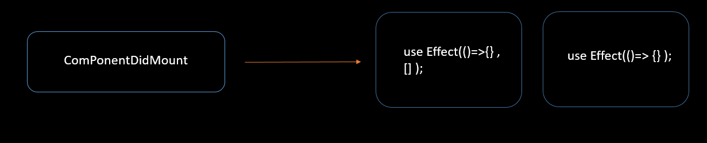
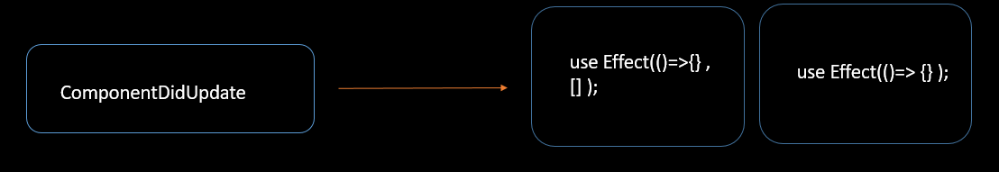
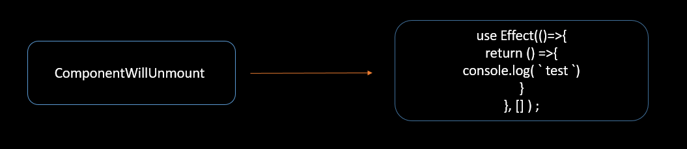

# React Hooks Life Cycle
React Hook은 함수형 컴포넌트에서 클래스형 컴포넌트의 기능을 구현한 개념입니다.

예를 들어 클래형 state를 훅(Hook)을 이용해서 함수형 Component에서도 
useState를 이용해서 상태 변수를 선언 할 수 있습니다.

또한 `useEffect()` 를 통해 리액트 클래스의 componentDidMount , componentDidUpdate , componentWillUnmount와 같은 라이프 사이클을 관리할 수 있습니다.


<br>
<br>

# componentDidMount 
빈 종속성 배열이 있는 useEffect가 이방법을 대체합니다.
배열에 값이 제공되지 않으면 마운트(랜더링) 시 후크만 평가합니다.




<br>
<br>


# componentDidUpdate
이 메서드는 종속성 배열이나 종속성 배열의 값이 없는 useEffect로 대체됩니다.

배열 자체가 제공되지 않으면 Hook는 다시 랜더링 할 때마다 평가됩니다.

배열에 값이 제공되면 해당 값이 변경될 때 후크가 평가됩니다.




<br>
<br>

# componentWillUnmount
return 문이 있는 UseEffect가 이 기술을 대체 했습니다.

useEffect()가 함수를 반환하면 해당 함수는 구성 요소가 DOM에서 제거된 후에만 호출됩니다.



<br>
<br>


# useEffect

```js
const value = useContext(MyContext);
```

useEffect 함수는 리액트 컴포넌트가 랜더링 될 때마다 특정 작업을 실행할 수 있도록 하는 Hook입니다.

컴포넌트가 마운트 됐을때(처음 나타날때) , 언마운트 됐을때 (사라질 때)
업데이트 됐을때(특정 props) 바뀔 때 특정 작업을 처리할때 주로 사용합니다.

<br>
<br>


## 기본 형태
```js
useEffect( function , deps)
```

- function : 수행하고자 하는 작업
- deps : 배열 형태이며 , 배열 안에는 검사하고자 하는 특정 값 or 빈 배열


<br>


## 1. Component가 mount 됐을 때 ( 처음 나타남 )

- 컴포넌트가 화면에 가장 처음 랜더링 될 때 한 번만 실행하고 싶을 때는 deps 위치에 빈 배열을 넣는다.


<br>

```js
useEffect(()=>{

    console.log('랜더링 될 때마다 실행된다');
});

```

<br>


랜더링 될 때마다 실행되는 예제입니다.<br>
Click  ,  Change Name 버튼이 생성이 되고 각 버튼이 클릭이 되면서 랜더링이 진행되고 ,
Hello가 출력이 되는 것 입니다.


```js
const NumberRender=()=>{


    const [number,setNumber] = useState(0);
    const [name,setName]= useState('Jeno Seung Hwan');


    useEffect(()=>{
        console.log('Hello');
    });


    const counter = ()=>{
        setNumber(number+1);
    }

    const nameChange =()=>{
        setName('Mike');
    }
    return(
        <div>
                    <button onClick={counter}>Click</button>
                    <button onClick={nameChange}>Change Name</button>


                    <div>{number}</div>
                    <div>{name}</div>
        </div>
    )

}
export default NumberRender;
```

<br>
<br>


## 2 Component가 단 한번만 실행하고 싶을 때 
- useEffect를 랜더링 후 단 한번만 실행하고 싶을 때 사용하는 방법입니다.

```js
useEffect(()=>{
    console.log('랜더링 후 한번만 실행된다.');
},[]);
```


<br>
<br>


이번에는 위와 동일한 예제에서 deps에 [] 을 넣어주어서 랜더링이 되고 나서 한번만 실행되게 만들어주는 예제 입니다.

이렇게 되면 첫 화면이 랜더링이 되고 `Hello가` 나오게 됩니다.
```js
import React, { useEffect } from 'react';
import { useState } from 'react';


const NumberRender=()=>{


    const [number,setNumber] = useState(0);
    const [name,setName]= useState('Jeno Seung Hwan');


    useEffect(()=>{
        console.log('Hello');
    },[number]);


    const counter = ()=>{
        setNumber(number+1);
    }

    const nameChange =()=>{
        setName('Mike');
    }
    return(
        <div>
                    <button onClick={counter}>Click</button>
                    <button onClick={nameChange}>Change Name</button>


                    <div>{number}</div>
                    <div>{name}</div>
        </div>
    )

}
export default NumberRender;
```


<br>
<br>

## 3. Component가 update 될 때 ( 특정 props , state가 바뀔 때)
- `특정값이 (name)` 업데이트 될 때 실행하고 싶을 때는 deps 위치의 배열 안에 검사하고 싶은 값을 넣어준다.

```js

useEffect(()=>{

    console.log('name값이 업데이트 될 때 실행된다');

},[name]);

```

<br>


마지막으로 deps에 name값을 넣어줌으로써 name값이 변경될때만 Hello가 출력되게 만들어줍니다.

```js

import React, { useEffect } from 'react';
import { useState } from 'react';


const NumberRender=()=>{


    const [number,setNumber] = useState(0);
    const [name,setName]= useState('Jeno Seung Hwan');


    useEffect(()=>{
        console.log('Hello');
    },[name]);


    const counter = ()=>{
        setNumber(number+1);
    }

    const nameChange =()=>{
        setName('Mike');
    }


    return(
        <div>
                    <button onClick={counter}>Click</button>
                    <button onClick={nameChange}>Change Name</button>


                    <div>{number}</div>
                    <div>{name}</div>
        </div>
    )

}
export default NumberRender;
```

<br>

# useMemo
useMemo를 알아보기전에 알고리즘에 `Memoization`에 대해서 알아보겠습니다.
`Memoization` 이라는 것은 기존에 수행한 연산의 결과값을 어딘가에 저장해두고 동일한 입력이 들어오면 재활용하는 기법입니다. 

중복 연산을 피할 수 있기 때문에 메모리를 조금 더 쓰더라도 애플리케이션의 성능을 최적화 할 수 있습니다.


<br>

즉 useMemo는 이 메모제이션 방식을 사용해서 메모리에 담아두었다가 특정 값이 바뀌었을 때 연산을 동작하게 하는 방식입니다.


<br>

```js

const avg = useMemo(() =>{
	//내용
},[값]);

```

인자로 값을 넘겨 값이 변경되면  함수를 재실행합니다.


<br>
<br>


## useMemo 사용하기 전 
```js
import React from 'react';
import { useState } from 'react';
const Average=()=>{


    const [list, setList]=useState([]);

    const [number, setNumber]=  useState('');


    
    const getAvergae=()=>{

        console.log('평균값 계산중');
        
        if(list.length ===0) return 0;


        // 배열에 있는 원소 나열해서 더함
        const sum = list.reduce((a,b)=>a+b);


        return sum / list.length;
    };


    const onChange=(e)=>{
        setNumber(e.target.value);
    }


    const onInsert=(e)=>{

        // push 대신 concat사용해서 배열에 값 추가 
        const nextList = list.concat(Number(number));

        setList(nextList);

        setNumber('');
    };


    return(
        <div>
            <input value={number} onChange={onChange}/>
            <button onClick={onInsert}>등록</button>
            <ul>
                {
                list.map((value,index)=>(
                    
                    <li key={index}>{value}</li>
                    
                ))}                
            </ul>

            <div>
                <b>평균값;</b> {getAvergae}
            </div>
        </div>
    )
}
export default Average;
```


<br>
<br>

## useMemo 사용 후
```js
import React, { useMemo } from 'react';
import { useState } from 'react';
const Average=()=>{


    const [list, setList]=useState([]);

    const [number, setNumber]=  useState('');


    
    const getAvergae= useMemo(()=>{
        console.log('평균값 계산중');
        
        if(list.length ===0) return 0;

        // 배열안에 있는 원소들 나열해서 더해줌
        const sum = list.reduce((a,b)=>a+b);
        return sum / list.length;
    },[list]);

    
    const onChange=(e)=>{
        setNumber(e.target.value);
    }

    const onInsert=(e)=>{
        const nextList = list.concat(Number(number));

        setList(nextList);

        setNumber('');
    };

    return(
        <div>
            <input value={number} onChange={onChange}/>
            <button onClick={onInsert}>등록</button>
            <ul>
                {
                list.map((value,index)=>(

                            
                    <li key={index}>{value}</li>
                    
                ))}                
            </ul>

            <div>
                <b>평균값;</b> {getAvergae}

            </div>
        </div>
    )
}

export default Average;
```

<br>
<br>

글자 입력 시에도 `getAvergae` 함수가 동작하기 때문에 콘솔창에 '평균값 계산중' 이라고 나오게 됩니다.
그리고 버튼 입력 시에도 `getAverage` 함수가 동작 하기 때문에 콘솔창에 '평균값 계산중' 이 나오게 되는데
종합적으로 , `getAverage` 함수가 필요하지 않는 곳에서 작동이 되는 현상이 발생합니다.


<br>
<br>

# useMemo vs useEffect

둘다 deps를 사용해서 값을 업데이트 한다는 공통점이 있습니다.<br>
그럼 2개의 차이점은 무엇일까요?

<br>

useMemo는 메모제이션 방식을 사용해서 값을 업데이트를 합니다.
즉 , useEffect로 값을 업데이트 하는 동시에 성능을 향상 시키고 싶다면 useMemo를 사용해서 이를 개선할 수 있습니다.

<br>

- `useEffect` : deps 배열의 요소가 변경되거나 배열이 생략된 경우 각 `렌더링 후`에 호출이 됩니다. 즉 랜더링을 한번더 하기 때문에  랜더링 성능을 효율적으로 하기가 힘듭니다. 

<br>

- `useMemo` : deps 배열의 요소가 변경되거나 베열이 생략된 경우 랜더링 전에 호출이 됩니다. 즉 `랜더링을 이전`에 하기 때문에 성능을 효율적으로 사용 할 수 있습니다.


<br>
<br>


# useRef

```js
const refContainer = useRef(initialValue);
```

JS에서는 특정 DOM을 선택할 때 `getElmenyId` , `querySelector` 같은 DOM Selector 함수를 사용해서 DOM을 선택합니다.

리액트를 사용하는 프로젝트에서도 가끔씩 DOM을 직접 선택해야하는 상황이 오는데 예를 들어 스크롤바 위치를 가져오거나 , 특정 엘리먼트 크기를 가져와야 한다던지 , 다양한 상황들이 찾아옵니다.


이때 리액트에서는 `ref` 라는 것을 사용합니다.

<br>

그리고 함수형에서는 `useRef` 라는 Hook 함수를 사용합니다.
> 클래스형에서는 `React.createRef` 라는 함수를 사용

<br>

본질적으로 **useRef** 즉 `ref`는 .current 프로퍼티에 변경 가능한 값을 담고 있는 상자와 같습니다.


<br>


## 자 그럼 예제 코드를 확인해보겠습니다.

<br>

```js

function ManualCounter(){


     // 배열 비구조화 할당
    const [count, setCount] = useState(0);


    // useRef로 값 초기화
    const interValId = useRef(null);

    console.log(`랜더링...count ${count}`);


    //interValId.current로 해당 값이 자동으로 5초마다 증가하게 만들어줌 
    // 이때 setInterval 사용

    // setInterval : 함수를 주기적으로 실행
    // setTimeOut : 함수를 한번만 실행
    const stratCounter =()=>{
        interValId.current=setInterval(()=>{
            setCount((count)=> count+1);
        },500);
        
        console.log(`시작...intervaild  : ${interValId.current}`);
    }


    const clearCounter=()=>{
        clearInterval(interValId.current,1000);
    }


    return(

        <main>
            <p>자동 카운트 : {count}</p>

            <button onClick={stratCounter}>시작</button>
            <button onClick={clearCounter}>멈춤</button>
            
        </main>
    );
}

export default ManualCounter;
```


<br>
<br>


# useCallback

첫번째로 인자로 넘어온 함수를 , 두번째 인자로 넘어온 배열 내의 값이 변경될 때까지 저장해놓고 재사용할 수 있게 해줍니다.


`useCallback`은 제공된 deps를 기준으로 반환된 함수 객체를 메모제이션 한다.
즉 , 동일한 deps가 제공되면 (참조로 비교) 동일한 함수 객체를 반환한다.


```js

const memoizedCallback = useCallback(함수, 배열);

```

<br>


예를들어 항상 동일한 결과값을 제공해주는 함수가 있다고 가정합니다.

리액트를 개발하다보면 리 랜더링하는 상황이 찾아오는데 이때 항상 동일한 결과값을 제공해주는 함수들도 함께 렌더링이 일어납니다.

이것은 다른 말로 똑같은 데이터를 지웠다가 똑같은 상태의 함수를 다시 생성하는 불필요한 작업을 뜻합니다.


이런 상황에서 `메모제이션`을 사용하여 함수를 저장해 두고 있다면 다시 처음부터 만드는 것이 아니라 이미 만들어져 있는 함수를 가져오기만 한다면 더 빠른 속도로 렌더링 되는 것을 도와줍니다.


# 의존 배열로 함수를 넘길 때
많은 `React hook` 함수들이 불필요한 작업을 줄이기 위해서 두번째 인자로 , 첫번째 함수가 의존해야하는 배열을 받습니다.

예를 들어 , `useEffect()` 함수는 두번째 인자로 넘어온 의존 배열이 변경될 때만 첫번째 인자로 넘어온 함수를 호출합니다.


# useReducer


# useContext


